 
<p align="center">  </p>

# <h1 align="center">Swipeat</h1>


<p align="center">
Swipeat is a simple and efficient meal tracking app.  
Add meals once, then swipe daily to log them — fast, easy, and consistent.
</p>

---

## ✨ Features

- 🥗 Add your meals one time only
- 👆 Swipe daily to log meals instantly
- 📊 Track your eating habits with ease
- 📱 Clean and minimal UI
## 🚀 Installation

```bash


## 🚀 Getting Started

### Prerequisites
- [Node.js](https://nodejs.org/) (LTS recommended)
- [Expo CLI](https://docs.expo.dev/get-started/installation/)
- [Expo Go app](https://expo.dev/go?sdkVersion=52&platform=android&device=true)

### Installation

```bash
# Clone the repository
git clone https://github.com/username/swipeat.git

# Navigate into the project
cd swipeat

# Install dependencies
npm install
npx expo start --lan
```
## 📱 Screenshots
<p align="center"> 
 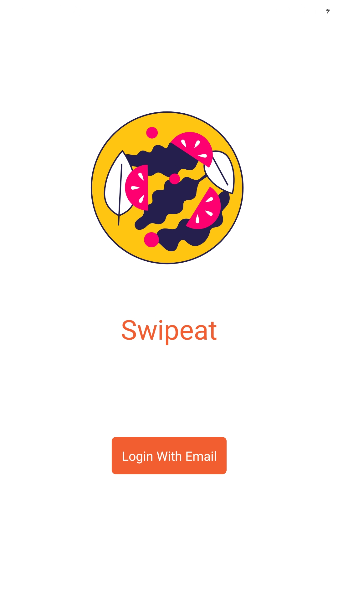 
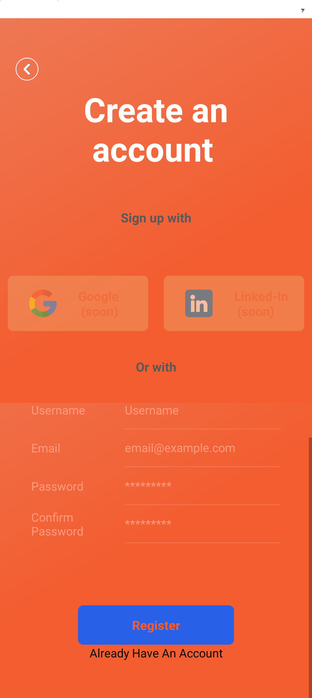 
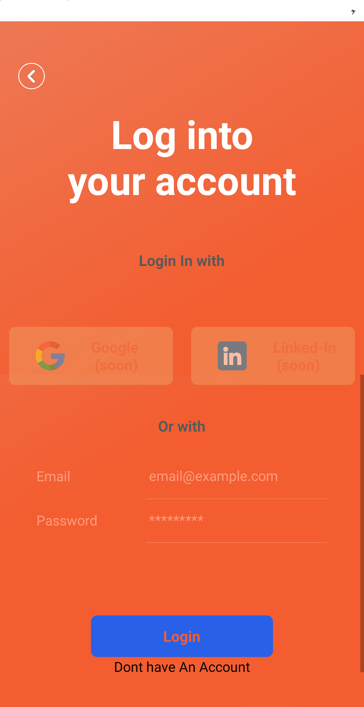 
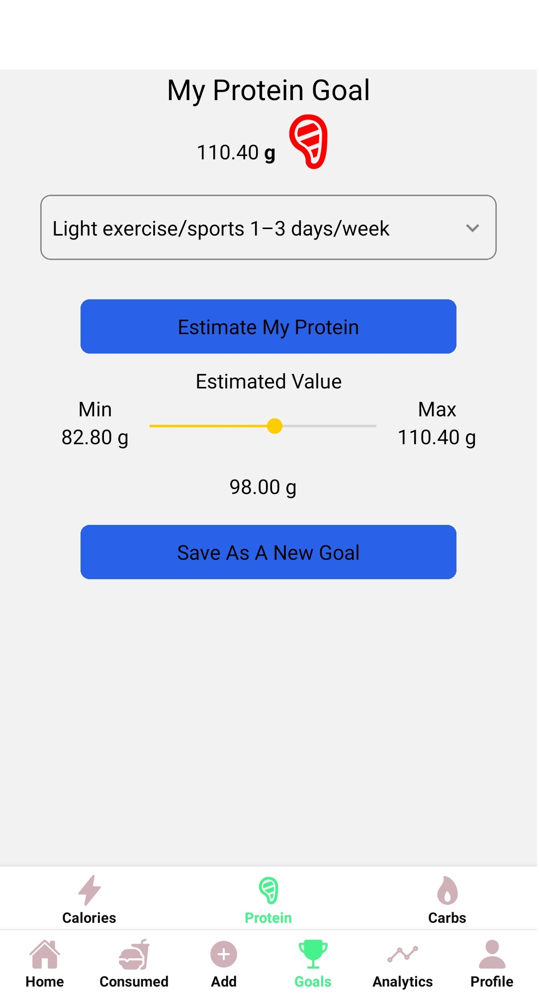 
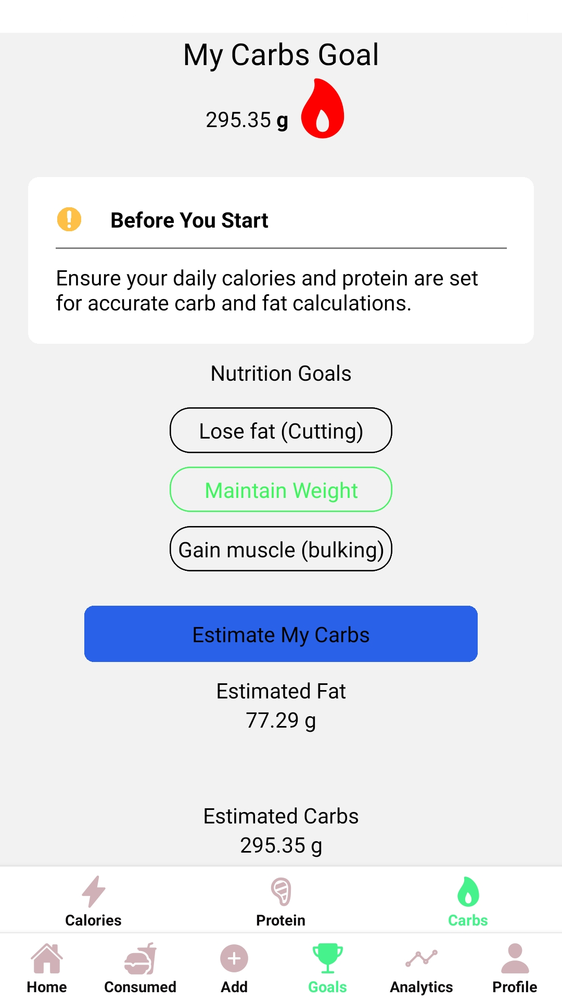 
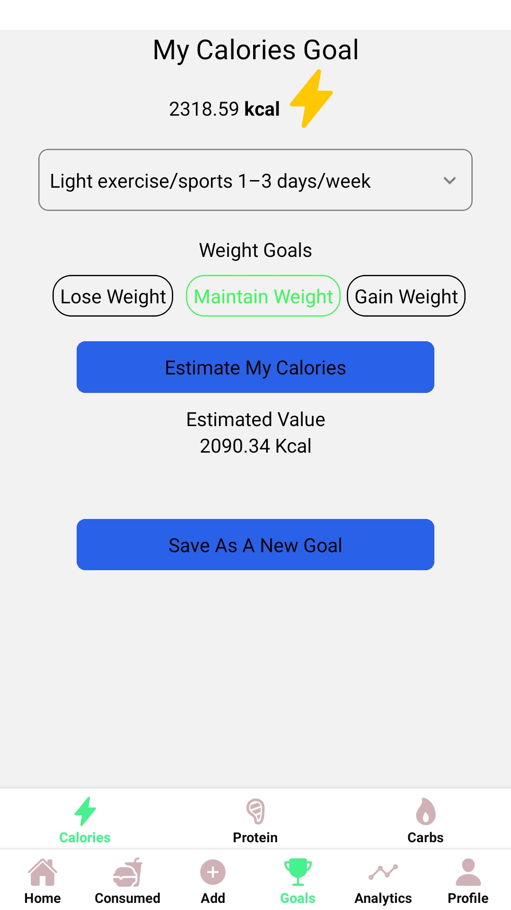 
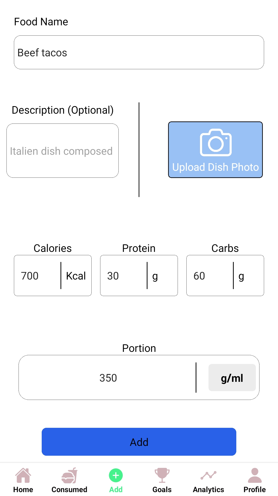 
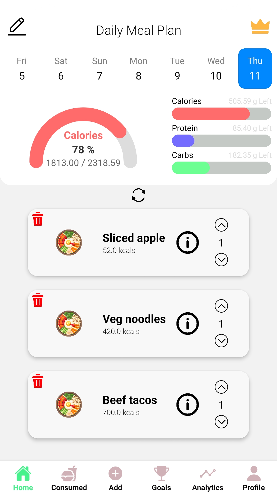 
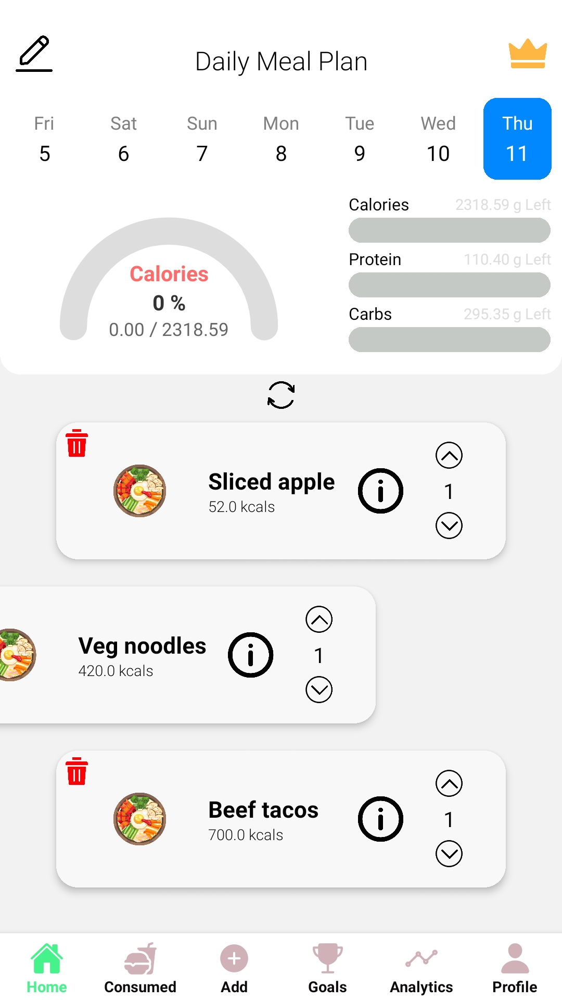 
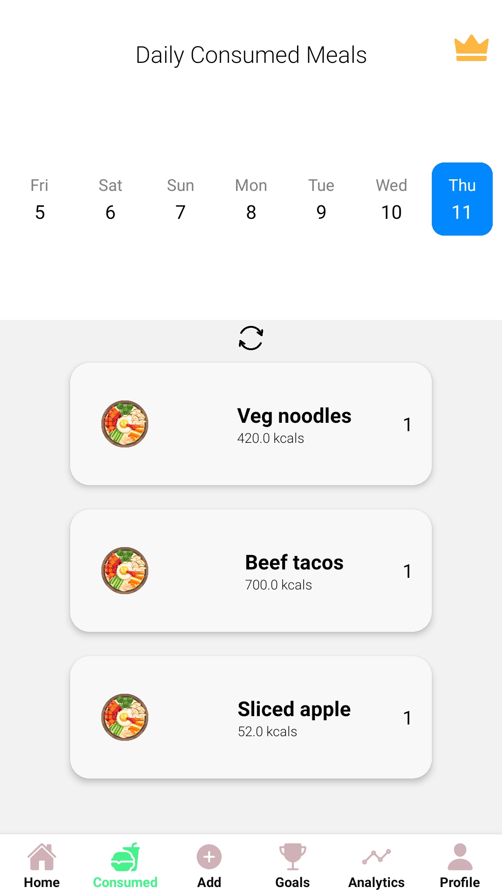 
 
 
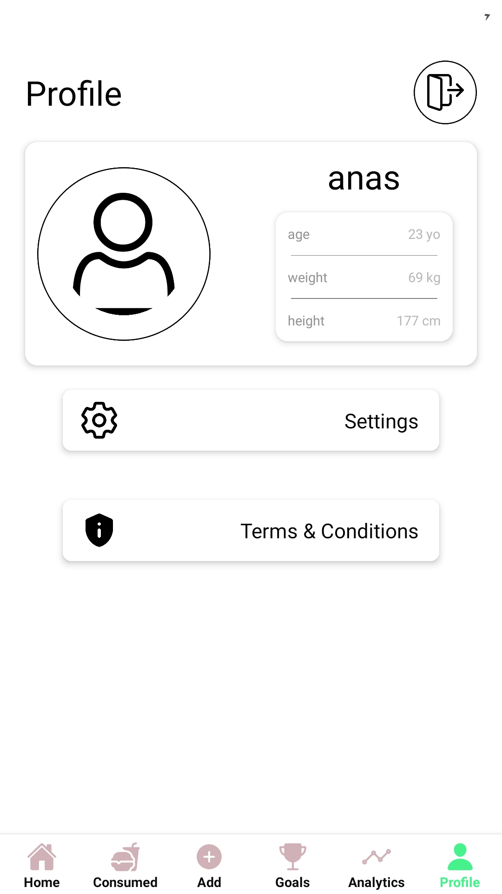 
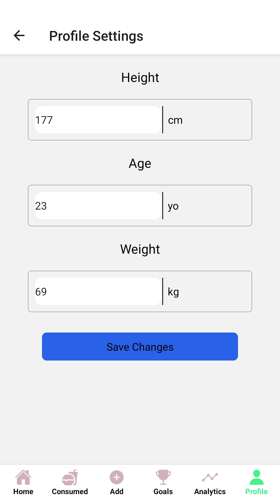 
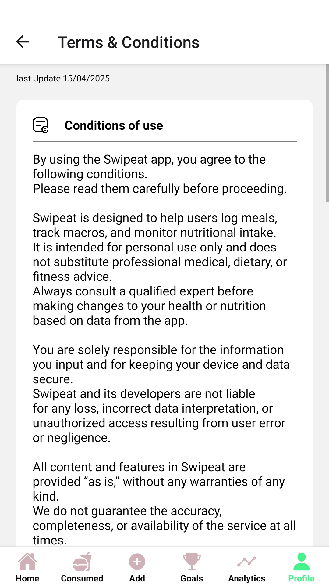 

</p>


## 🛠️ Tech Stack

React Native

Expo

## 🤝 Contributing

This is a private project, but feel free to fork it or suggest improvements.

## 📄 License

This project is licensed under the MIT License.
See the LICENSE
 file for details.


---

Bro, do you want me to also add a **badges section** (like downloads, stars, ve
